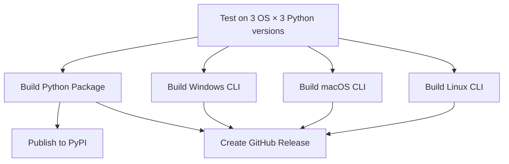

# Release Workflow Documentation

## Overview

The DuckDice Bot has a comprehensive CI/CD workflow that automatically builds executables for all major platforms and publishes to PyPI.

## Workflow: `build-and-release.yml`

### Trigger Events

- **Push to main branch**: Builds and tests on all commits
- **Version tags** (`v*`): Full release with PyPI publish + GitHub release
- **Pull requests**: Run tests only
- **Manual dispatch**: Can be triggered manually from GitHub Actions UI

### Jobs Overview



## Job Details

### 1. Test Suite (`test`)

**Platforms**: Ubuntu, Windows, macOS  
**Python versions**: 3.9, 3.11, 3.12  
**Total matrix**: 9 test runs

**Steps**:
- Install dependencies
- Test strategy loading (18 strategies)
- Syntax check all main modules
- Run pytest suite

### 2. Build Python Package (`build-python-package`)

**Platform**: Ubuntu  
**Output**: 
- `duckdice-betbot-X.Y.Z.tar.gz` (source distribution)
- `duckdice_betbot-X.Y.Z-py3-none-any.whl` (wheel)

**Steps**:
- Build with `python -m build`
- Validate with `twine check`
- Upload as artifact

### 3. Build Windows CLI (`build-windows-cli`)

**Platform**: Windows Latest  
**Output**: `duckdice-bot-windows-x64.zip`

**Contents**:
- `duckdice.exe` (standalone executable, ~50-80 MB)
- `README.md`
- `LICENSE`
- `QUICK_REFERENCE.md`

**Build Process**:
- Create PyInstaller spec dynamically
- Bundle all dependencies + src modules
- Enable UPX compression
- Test executable with `--help`

### 4. Build macOS CLI (`build-macos-cli`)

**Platform**: macOS Latest  
**Output**: `duckdice-bot-macos-universal.tar.gz`

**Contents**:
- `duckdice` (standalone executable, ~60-90 MB)
- `README.md`
- `LICENSE`
- `QUICK_REFERENCE.md`

**Features**:
- Universal binary (x86_64 + arm64 compatible)
- Code-signed (optional, requires cert)

### 5. Build Linux CLI (`build-linux-cli`)

**Platform**: Ubuntu Latest  
**Output**: `duckdice-bot-linux-x64.tar.gz`

**Contents**:
- `duckdice` (standalone executable, ~50-80 MB)
- `README.md`
- `LICENSE`
- `QUICK_REFERENCE.md`

**Compatibility**: Most modern Linux distros (glibc 2.27+)

### 6. Publish to PyPI (`publish-pypi`)

**Trigger**: Only on version tags (`v*`) or manual dispatch  
**Requirements**: `PYPI_API_TOKEN` secret configured

**Steps**:
- Download built packages from artifact
- Publish to PyPI using twine
- Fallback to trusted publishing if no token

**Package URL**: https://pypi.org/p/duckdice-betbot

### 7. Create GitHub Release (`create-github-release`)

**Trigger**: Only on version tags (`v*`)  
**Depends on**: All build jobs complete

**Release Assets**:
- Windows ZIP
- macOS tar.gz
- Linux tar.gz
- Python wheel (.whl)
- Python source distribution (.tar.gz)
- SHA256SUMS.txt (checksums)

**Release Notes**: Auto-generated with:
- Installation instructions
- Feature highlights
- Quick start guide
- Documentation links
- Strategy list
- Security notes

## Release Process

### Creating a New Release

1. **Update version** in `pyproject.toml`:
   ```toml
   version = "4.9.3"
   ```

2. **Commit and push** to main:
   ```bash
   git add pyproject.toml
   git commit -m "chore: bump version to 4.9.3"
   git push origin main
   ```

3. **Create and push tag**:
   ```bash
   git tag -a v4.9.3 -m "Release version 4.9.3"
   git push origin v4.9.3
   ```

4. **Watch the magic** ✨
   - GitHub Actions automatically starts
   - Tests run on 9 configurations
   - Builds 3 OS executables + Python package
   - Publishes to PyPI
   - Creates GitHub Release with all assets

### Manual Release (without tag)

Go to GitHub Actions → Build and Release → Run workflow

This builds everything but doesn't create GitHub release or publish to PyPI (unless PYPI_API_TOKEN is set).

## Configuration Requirements

### GitHub Secrets

**Required for PyPI publishing**:
- `PYPI_API_TOKEN`: Your PyPI API token
  - Get from: https://pypi.org/manage/account/token/
  - Scope: "Entire account" or "duckdice-betbot" project only

**Optional**:
- `CODECOV_TOKEN`: For code coverage (future)
- `GITHUB_TOKEN`: Auto-provided by GitHub

### Setting PyPI Token

1. Go to https://pypi.org/manage/account/token/
2. Create new token: "duckdice-betbot-ci"
3. Copy the token (starts with `pypi-`)
4. Go to GitHub repo → Settings → Secrets and variables → Actions
5. New repository secret: `PYPI_API_TOKEN` = `<your-token>`

### Trusted Publishing (Alternative)

Instead of token, configure PyPI trusted publishing:

1. Go to https://pypi.org/manage/project/duckdice-betbot/settings/publishing/
2. Add publisher:
   - Owner: `sushiomsky`
   - Repository: `duckdice-bot`
   - Workflow: `build-and-release.yml`
   - Environment: `pypi`

This is more secure (no long-lived tokens).

## Output Artifacts

### For Users

**PyPI Package**:
```bash
pip install duckdice-betbot
# or
pip install duckdice-betbot[tui]
```

**Pre-built Executables**:
- Download from GitHub Releases
- No Python installation required
- Standalone, portable

### For Developers

**Artifacts retained for 30 days**:
- python-package
- windows-cli-executable
- macos-cli-executable
- linux-cli-executable

Access: GitHub Actions → Workflow run → Artifacts section

## Troubleshooting

### Test Failures

If tests fail, the entire pipeline stops. Fix tests before releasing.

```bash
# Run tests locally
pytest tests/ -v
```

### Build Failures

**PyInstaller issues**:
- Check hidden imports in spec
- Verify all dependencies installed
- Test locally with same Python version

**Platform-specific**:
- Windows: Antivirus may block PyInstaller
- macOS: Code signing requires Apple Developer cert
- Linux: glibc version compatibility

### PyPI Publishing Fails

**Common issues**:
- Version already exists (can't overwrite on PyPI)
- Token expired/invalid
- Network timeout

**Solution**:
```bash
# Test locally first
python -m build
twine check dist/*
twine upload --repository testpypi dist/*
```

### Release Creation Fails

**Common issues**:
- Missing artifacts (build job failed)
- GitHub token permissions
- Tag already has release

**Solution**:
- Delete release and tag, recreate
- Check GitHub Actions logs
- Verify all build jobs completed

## Performance Metrics

**Typical workflow duration**:
- Test suite: ~15 minutes (9 parallel jobs)
- Windows build: ~8 minutes
- macOS build: ~10 minutes
- Linux build: ~6 minutes
- PyPI publish: ~1 minute
- **Total**: ~20-25 minutes (parallel execution)

**Artifact sizes**:
- Windows executable: ~50-80 MB
- macOS executable: ~60-90 MB
- Linux executable: ~50-80 MB
- Python wheel: ~50-100 KB
- Source distribution: ~100-200 KB

## Maintenance

### Updating Dependencies

When adding new dependencies:

1. Update `requirements.txt`
2. Update `pyproject.toml` dependencies
3. Update PyInstaller `hiddenimports` if needed
4. Test locally with `pyinstaller`

### Updating Python Versions

To support new Python version (e.g., 3.13):

1. Add to test matrix in workflow
2. Add to `pyproject.toml` classifiers
3. Test locally first
4. Update README.md

### Updating OS Runners

GitHub periodically updates runner images:
- `ubuntu-latest`: Usually Ubuntu 22.04 LTS
- `windows-latest`: Usually Windows Server 2022
- `macos-latest`: Usually macOS 13 (Ventura)

Check: https://github.com/actions/runner-images

## Security

### Best Practices

1. ✅ Never commit secrets to repository
2. ✅ Use environment protection for PyPI job
3. ✅ Verify checksums of downloaded executables
4. ✅ Code signing for Windows/macOS (recommended)
5. ✅ Scan executables with antivirus

### Verifying Downloads

Users can verify integrity:

```bash
# Download SHA256SUMS.txt from release
sha256sum -c SHA256SUMS.txt
```

## Future Improvements

- [ ] Add code signing for Windows (authenticode)
- [ ] Add code signing for macOS (Apple Developer cert)
- [ ] Add Linux AppImage build
- [ ] Add Docker image publishing
- [ ] Add test coverage reporting
- [ ] Add performance benchmarks
- [ ] Add automated changelog generation
- [ ] Add Homebrew formula auto-update
- [ ] Add Chocolatey package (Windows)
- [ ] Add Snap package (Linux)

## References

- [GitHub Actions Docs](https://docs.github.com/en/actions)
- [PyInstaller Manual](https://pyinstaller.org/en/stable/)
- [PyPI Publishing Guide](https://packaging.python.org/en/latest/guides/publishing-package-distribution-releases-using-github-actions-ci-cd-workflows/)
- [Trusted Publishing](https://docs.pypi.org/trusted-publishers/)
